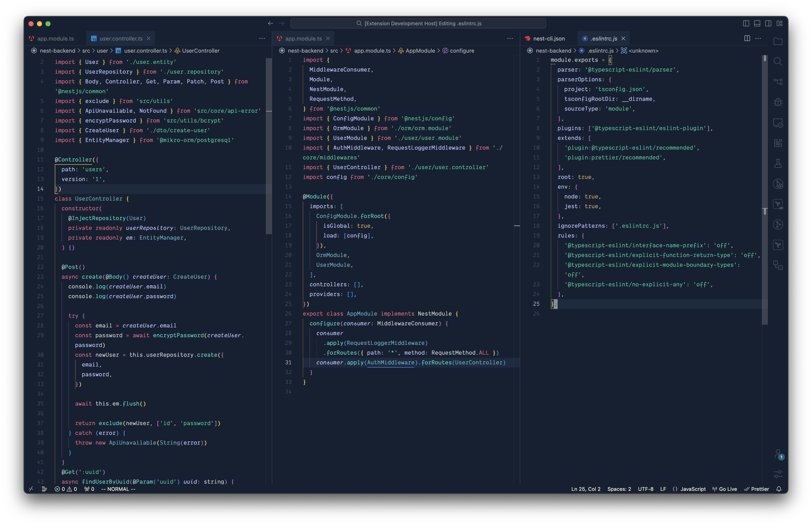

# Hydrocarbon for vscode



## Usage

Preferred method of installation is through [vscode marketplace]()

## Customization

### Recommended vscode settings

These are my personal settings on vscode:

```json
{
  "editor.fontWeight": "500",
  "editor.lineHeight": 23,
  "window.title": "Editing ${dirty}${activeEditorShort}",
  "editor.fontSize": 14
}
```

The font used here is SF Mono.

## Language Support

Supports syntax highlighting for all listed languages:

- Rust
- Go
- PHP
- Java
- ELM
- HTML
- Coffeescript
- Markdown
- CSS/SCSS
- Javascript/Typescript
- Python

### Acknowledgement

[oscarnewman](https://github.com/oscarnewman) created a theme as [Carbon](https://github.com/oscarnewman/carbon-theme-vscode), this theme is highly inspired from it. <i>Hydrokarbon</i> exhibits a wide array of colors that appear soothing to the eyes, having support for multiple dev tools that are used widely.
